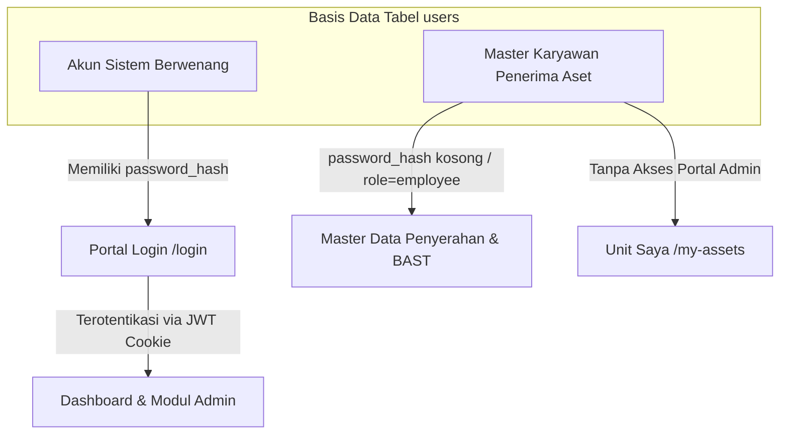
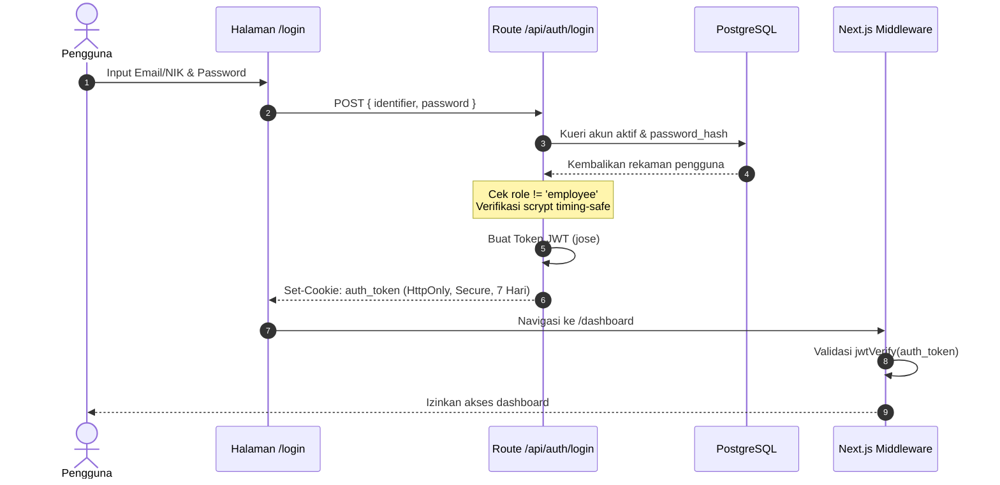

# Dokumentasi Manajemen Akun, Autentikasi & Hak Akses (RBAC)

Dokumen ini menjelaskan arsitektur autentikasi, pembagian peran (*Role-Based Access Control*), akun bawaan (*seed*), mekanisme keamanan sandi, serta prosedur operasional pengelolaan akun pada sistem **IT Asset Management**.

---

## 📑 Daftar Isi

1. [Arsitektur Akun: Akun Sistem vs. Master Karyawan](#1-arsitektur-akun-akun-sistem-vs-master-karyawan)
2. [Matriks Peran & Hak Akses (Role Matrix)](#2-matriks-peran--hak-akses-role-matrix)
3. [Daftar Akun Bawaan Sistem (Data Seed)](#3-daftar-akun-bawaan-sistem-data-seed)
4. [Mekanisme Keamanan & Autentikasi](#4-mekanisme-keamanan--autentikasi)
5. [Panduan Operasional Pengelolaan Akun (SOP)](#5-panduan-operasional-pengelolaan-akun-sop)
6. [Troubleshooting & Solusi Kendala Akun](#6-troubleshooting--solusi-kendala-akun)

---

## 1. Arsitektur Akun: Akun Sistem vs. Master Karyawan

Sistem memisahkan entitas pengguna ke dalam 2 kelompok utama untuk menjaga integritas dan kepatuhan tata kelola TI:



### 1.1. Akun Sistem Berwenang (System Login Accounts)
- Ditujukan untuk pejabat struktural dan staf yang berwenang mengelola, menyetujui, serta mengawasi aset.
- **Karakteristik:** Memiliki `password_hash`, status aktif (`is_active = true`), dan salah satu role berwenang:
  `director`, `head_it`, `it_asset_manager`, `finance`, `lead_it_gov`, `super_admin`, atau `it_technician`.
- Berhak masuk melalui antarmuka **Login Portal** (`/login`).

### 1.2. Master Data Karyawan (Asset Recipients)
- Ditujukan untuk seluruh karyawan perusahaan yang menjadi pengguna akhir (*end-user*) perangkat kerja (laptop, monitor, smartphone operasional).
- **Karakteristik:** `role = 'employee'`, tidak memiliki `password_hash`, dan tidak diizinkan masuk ke dashboard administrasi.
- **Tujuan:** Menjadi referensi entitas penerima pada transaksi penyerahan unit (*Check-out*), penandatanganan Berita Acara Serah Terima (BAST), dan pengembalian unit (*Check-in*).

---

## 2. Matriks Peran & Hak Akses (Role Matrix)

Berikut adalah kewenangan dan fungsi operasional masing-masing role:

| Modul / Tindakan | Direktur (`director`) | Head of IT (`head_it`) | IT Asset Mgr (`it_asset_manager`) | Finance (`finance`) | IT Gov (`lead_it_gov`) | Teknisi (`it_technician`) | Admin (`super_admin`) | Karyawan (`employee`) |
| :--- | :---: | :---: | :---: | :---: | :---: | :---: | :---: | :---: |
| **Lihat Dashboard KPI** | ✅ | ✅ | ✅ | ✅ | ✅ | ✅ | ✅ | ❌ |
| **Katalog Master Aset** | ✅ | ✅ | ✅ | ✅ | ✅ | ✅ | ✅ | ❌ |
| **Tambah / Edit Aset** | ❌ | ✅ | ✅ | ❌ | ❌ | ❌ | ✅ | ❌ |
| **Check-out / Check-in Aset** | ❌ | ✅ | ✅ | ❌ | ❌ | ❌ | ✅ | ❌ |
| **Cetak Dokumen BAST** | ✅ | ✅ | ✅ | ✅ | ✅ | ✅ | ✅ | ❌ |
| **Pendaftaran Tiket Servis** | ❌ | ✅ | ✅ | ❌ | ❌ | ✅ | ✅ | ✅ *(Self)* |
| **Penyelesaian Servis & Biaya**| ❌ | ✅ | ✅ | ❌ | ❌ | ✅ | ✅ | ❌ |
| **Approval / Eksekusi Disposal**| ✅ *(Approve)*| ✅ *(Approve)*| ✅ *(Propose)*| ❌ | ✅ *(Audit)* | ❌ | ✅ | ❌ |
| **Scan QR Kamera Lapangan** | ❌ | ✅ | ✅ | ❌ | ❌ | ✅ | ✅ | ❌ |
| **Sesi Audit Opname Fisik** | ❌ | ✅ | ✅ | ❌ | ✅ | ✅ | ✅ | ❌ |
| **Kelola Lisensi Software** | ❌ | ✅ | ✅ | ✅ | ✅ | ❌ | ✅ | ❌ |
| **Kelola Master Divisi** | ❌ | ✅ | ✅ | ❌ | ❌ | ❌ | ✅ | ❌ |
| **Kelola Master Karyawan** | ❌ | ✅ | ✅ | ❌ | ❌ | ❌ | ✅ | ❌ |
| **Pendaftaran Akun Sistem** | ✅ | ✅ | ✅ | ❌ | ❌ | ❌ | ✅ | ❌ |
| **Akses Laporan Finansial** | ✅ | ✅ | ✅ | ✅ | ❌ | ❌ | ✅ | ❌ |
| **Ekspor Laporan CSV** | ✅ | ✅ | ✅ | ✅ | ✅ | ❌ | ✅ | ❌ |
| **Halaman Unit Saya** | ❌ | ❌ | ❌ | ❌ | ❌ | ❌ | ❌ | ✅ |

### Deskripsi Tugas & Wewenang Peran:

1. **Direktur (`director`)**
   - Akses tingkat eksekutif ke ringkasan aset, valuasi total, dan rekapitulasi pengeluaran.
   - Otoritas tertinggi pengesahan penghapusan/pemusnahan aset bernilai tinggi (*Disposal Approval*).
   - Hak mendaftarkan atau mengevaluasi akun pemegang otoritas sistem.

2. **Head of IT (`head_it`)**
   - Kepala divisi IT yang bertanggung jawab penuh atas seluruh siklus hidup perangkat.
   - Melakukan supervisi teknis, persetujuan biaya pemeliharaan vendor, dan penutupan sesi audit fisik (*Stock Opname*).
   - Memiliki wewenang pembuatan akun sistem baru.

3. **IT Asset Manager (`it_asset_manager`)**
   - Pengelola harian operasional inventaris TI.
   - Menjalankan mutasi penyerahan (*Check-out*), pengembalian (*Check-in*), penerbitan berkas BAST, pendaftaran tiket servis, dan pencetakan stiker QR label.
   - Mengelola master data divisi dan karyawan.

4. **Finance (`finance`)**
   - Bagian Keuangan dan Anggaran perusahaan.
   - Meninjau laporan pengeluaran servis/pemeliharaan (*maintenance costs*), biaya tahunan lisensi software berbayar, dan pencatatan nilai sisa (*residual/salvage value*) aset yang didisposisi.
   - Mengunduh rekapitulasi laporan dalam format CSV untuk pembukuan akuntansi.

5. **Lead IT Governance (`lead_it_gov`)**
   - Pengawas kepatuhan regulasi TI dan audit internal.
   - Memastikan kepatuhan lisensi perangkat lunak (mencegah *over-seat / unlicensed software*).
   - Mengawasi proses sanitasi data pada pemusnahan aset (NIST 800-88 / DoD 5220.22-M).
   - Memantau rekap hasil sesi verifikasi audit fisik.

6. **Teknisi Lapangan (`it_technician`)**
   - Tim teknis pelaksana di lapangan.
   - Mengoperasikan pemindai QR kamera (`/scan`) untuk pengecekan cepat perangkat.
   - Melakukan input verifikasi fisik pada sesi Stock Opname.
   - Menangani log perbaikan unit dan mencatat tindakan teknis.

7. **Super Admin (`super_admin`)**
   - Administrator teknis sistem untuk pemeliharaan database, integrasi sistem, dan troubleshooting.

8. **Karyawan (`employee`)**
   - Penerima inventaris kerja perusahaan.
   - Melihat unit apa saja yang menjadi tanggung jawabnya melalui portal mandiri `/my-assets` dan mengajukan tiket lapor kendala langsung ke tim IT.

---

## 3. Daftar Akun Bawaan Sistem (Data Seed)

Basis data menyertakan akun awal pada skrip `db/seed.sql`:

| NIK / Employee ID | Nama Pengguna | Alamat Email | Divisi | Role Sistem |
| :--- | :--- | :--- | :--- | :--- |
| `DIR-0001` | Budi Hartono | `director@company.com` | Executive Board | `director` |
| `HIT-0001` | Hendra Wijaya | `head.it@company.com` | Information Technology | `head_it` |
| `ITM-0001` | Dimas Pratama | `asset.mgmt@company.com` | Information Technology | `it_asset_manager` |
| `FIN-0001` | Ratna Sari | `finance@company.com` | Finance | `finance` |
| `GOV-0001` | Aris Munandar | `it.gov@company.com` | IT Governance | `lead_it_gov` |
| `EMP-0001` | Admin IT | `admin.it@company.com` | Information Technology | `super_admin` |
| `EMP-0002` | Teknisi Lapangan | `tech@company.com` | Information Technology | `it_technician` |
| `EMP-0142` | Febmy | `febmy@company.com` | Finance | `employee` *(Master)* |

> [!NOTE]
> Akun di atas dapat langsung diatur kata sandinya melalui menu **Pendaftaran Akun** (`/users`) oleh pengguna berwenang, atau dibuatkan password melalui skrip SQL (lihat bagian Troubleshooting).

---

## 4. Mekanisme Keamanan & Autentikasi

Sistem menerapkan prinsip pertahanan berlapis (*Defense-in-Depth*):



### 4.1. Algoritma Hashing Kata Sandi
- Menggunakan fungsi derivasi kunci **Node.js Crypto `scrypt`** standar industri.
- Setiap sandi diberi **salt acak 16-byte** unik dalam format heksadesimal.
- Hasil disimpan dalam format: `<salt_16_byte>:<scrypt_hash_64_byte>`.
- Verifikasi menggunakan `crypto.timingSafeEqual` untuk mencegah serangan *Timing Attack*.

### 4.2. Manajemen Sesi JWT (JSON Web Token)
- Menggunakan library modern `jose` dengan algoritma tanda tangan digital **HS256**.
- Masa berlaku sesi: **7 Hari** sejak diterbitkan.
- Disimpan dalam Cookie bernama `auth_token` dengan parameter:
  - `httpOnly: true` (Kebal dari serangan pencurian cookie via XSS).
  - `secure: true` (Otomatis aktif saat environment produksi HTTPS).
  - `sameSite: 'lax'` (Perlindungan dari serangan Cross-Site Request Forgery / CSRF).
  - `path: '/'`.

### 4.3. Proteksi Rute (Next.js Middleware)
- Seluruh rute dashboard (`/assets`, `/dashboard`, `/audit`, `/reports`, `/users`, dll.) diproteksi oleh `src/middleware.ts`.
- Permintaan tanpa token valid secara otomatis diarahkan ke `/login`.
- Pengguna yang telah login yang mencoba mengakses `/login` atau root `/` akan dialihkan langsung ke `/dashboard`.

---

## 5. Panduan Operasional Pengelolaan Akun (SOP)

### 5.1. Mendaftarkan Akun Sistem Baru
1. Masuk ke portal dengan akun berwenang (`director`, `head_it`, `it_asset_manager`, atau `super_admin`).
2. Buka menu navigasi **Pendaftaran Akun** (`/users`).
3. Klik tombol **"+ Daftarkan Akun Baru"**.
4. Isi formulir:
   - **ID Akun / NIK:** Kode unik identitas (contoh: `ITM-0002`).
   - **Nama Lengkap:** Nama resmi petugas.
   - **Alamat Email:** Email kantor resmi (contoh: `asset.team@company.com`).
   - **Divisi:** Pilih departemen terkait.
   - **Pilihan Role:** Pilih peran yang sesuai kewenangan (`Director`, `IT Asset Manager`, `Head of IT`, `Finance`, `Lead IT Governance`).
   - **Password & Konfirmasi:** Masukkan kata sandi aman (minimal 6 karakter).
5. Klik **"Simpan & Aktifkan Akun"**. Akun langsung aktif dan dapat digunakan untuk login seketika.

---

### 5.2. Mengubah Data Akun atau Mengganti Kata Sandi
1. Pada menu **Pendaftaran Akun** (`/users`), cari akun yang bersangkutan melalui kotak pencarian.
2. Klik tombol **"Edit"** pada baris akun yang diinginkan.
3. Anda dapat memperbarui nama, email, NIK, divisi, dan role.
4. **Untuk Mengganti Kata Sandi:**
   - Masukkan kata sandi baru pada kolom *Ganti Password Akun*.
   - Jika kolom password dikosongkan, sistem akan mempertahankan kata sandi lama tanpa perubahan.
5. Klik **"Perbarui Data Akun"**.

---

### 5.3. Menonaktifkan / Memblokir Akses Akun (Deaktivasi)
Jika petugas mutasi divisi atau berhenti bekerja:
1. Buka menu **Pendaftaran Akun** (`/users`).
2. Temukan akun target.
3. Klik tombol status **"Nonaktifkan"**.
4. Sistem akan meminta konfirmasi. Setelah dikonfirmasi:
   - Status akun berubah menjadi `Nonaktif` (`is_active = false`).
   - Upaya login berikutnya oleh akun tersebut akan ditolak oleh sistem.
   - Riwayat transaksi (BAST, log servis, audit opname) yang pernah dikerjakan oleh akun ini **tetap utuh dan terlacak** dalam basis data.

---

### 5.4. Pengelolaan Master Data Karyawan (Penerima Aset)
1. Buka menu navigasi **Data Karyawan** (`/employees`).
2. Untuk menambah penerima unit baru: Klik **"+ Tambah Karyawan"** dan masukkan NIK, Nama, Email, serta Divisi.
3. Tabel karyawan secara dinamis menampilkan jumlah unit aktif yang sedang dipinjam (`active_assets_count`) beserta tag asetnya.
4. **Aturan Hapus Karyawan:** Karyawan yang sedang memegang unit aktif **tidak dapat dihapus** dari sistem demi menjaga konsistensi data inventaris.

---

## 6. Troubleshooting & Solusi Kendala Akun

### Kendala 1: Karyawan Tidak Bisa Login ke Portal
- **Gejala:** Muncul pesan *“Karyawan hanya didaftarkan sebagai master data penerima aset dan tidak memiliki akun login...”*
- **Penyebab:** Pengguna memiliki `role = 'employee'`.
- **Solusi:** Ini adalah perilaku normal sistem. Karyawan biasa tidak diperkenankan mengakses portal administrasi. Jika karyawan tersebut dipromosikan menjadi staf IT atau pengelola aset, ubah rolenya menjadi `it_asset_manager` atau role berwenang lainnya melalui menu `/users`.

### Kendala 2: Akun Sistem Lupa Kata Sandi
- **Solusi 1 (Melalui Portal):** Minta administrator atau Head of IT membuka menu `/users`, klik **Edit** pada akun yang bersangkutan, dan masukkan kata sandi baru.
- **Solusi 2 (Melalui Kueri SQL Langsung):** Jika seluruh akun terkunci, Anda dapat membuat hash baru menggunakan Node.js dan mengupdatenya ke PostgreSQL:

```bash
# Generate hash baru untuk password 'Password123!'
node -e "const crypto = require('crypto'); const salt = crypto.randomBytes(16).toString('hex'); const hash = crypto.scryptSync('Password123!', salt, 64).toString('hex'); console.log(salt + ':' + hash);"
```

Lalu jalankan kueri SQL berikut di PostgreSQL:
```sql
UPDATE users 
SET password_hash = '<hasil_hash_dari_terminal_di_atas>', 
    is_active = TRUE 
WHERE email = 'admin.it@company.com';
```

### Kendala 3: Sesi Login Berakhir Tiba-tiba
- Token JWT berlaku selama 7 hari. Jika sesi berakhir, bersihkan cookie pada peramban web dan lakukan login ulang di `/login`.
