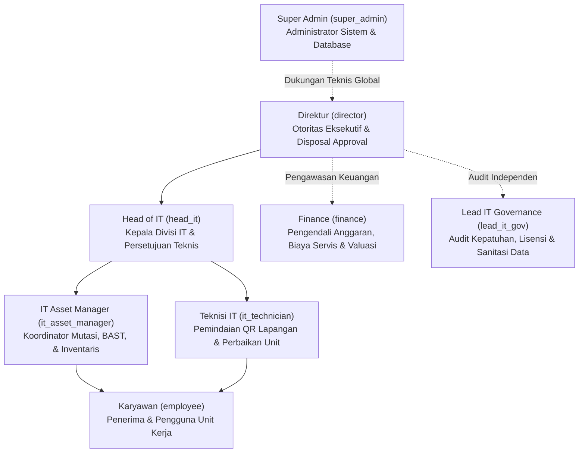
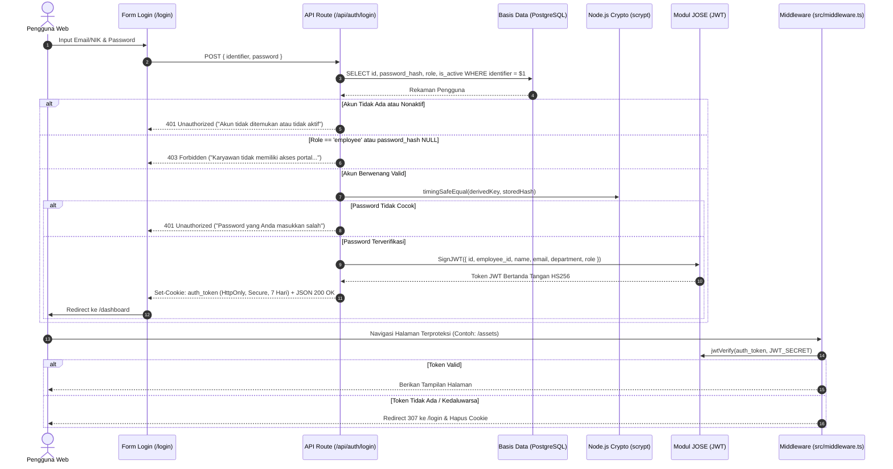

# Dokumentasi Manajemen Akun, Autentikasi & Hak Akses (RBAC)

Dokumen ini menjelaskan arsitektur autentikasi, pembagian peran (*Role-Based Access Control* / RBAC), hierarki wewenang, mekanisme keamanan kriptografi, prosedur operasional standar (SOP), serta pemecahan masalah (*troubleshooting*) akun pada sistem **IT Asset Management Enterprise**.

---

## 📑 Daftar Isi

1. [Ringkasan Eksekutif & Prinsip Keamanan](#1-ringkasan-eksekutif--prinsip-keamanan)
2. [Arsitektur Model Identitas Ganda (Dual Identity Model)](#2-arsitektur-model-identitas-ganda-dual-identity-model)
3. [Katalog & Hierarki Peran Pengguna (Role Catalog & Hierarchy)](#3-katalog--hierarki-peran-pengguna-role-catalog--hierarchy)
4. [Matriks Hak Akses Terperinci (Granular Access Control Matrix)](#4-matriks-hak-akses-terperinci-granular-access-control-matrix)
5. [Daftar Akun Bawaan Sistem (Default Seed Accounts)](#5-daftar-akun-bawaan-sistem-default-seed-accounts)
6. [Arsitektur Autentikasi, Kriptografi & Proteksi Sesi](#6-arsitektur-autentikasi-kriptografi--proteksi-sesi)
7. [Prosedur Operasional Standar Pengelolaan Akun (SOP)](#7-prosedur-operasional-standar-pengelolaan-akun-sop)
8. [Panduan Administrator Sistem (CLI & SQL Operations)](#8-panduan-administrator-sistem-cli--sql-operations)
9. [Panduan Pemecahan Masalah (Troubleshooting & FAQs)](#9-panduan-pemecahan-masalah-troubleshooting--faqs)
10. [Checklist Audit Kepatuhan & Keamanan Berkala](#10-checklist-audit-kepatuhan--keamanan-berkala)

---

## 1. Ringkasan Eksekutif & Prinsip Keamanan

Sistem **IT Asset Management Enterprise** mengelola seluruh siklus hidup perangkat keras (*Hardware Asset Management* / HAM) dan lisensi perangkat lunak (*Software Asset Management* / SAM). Mengingat nilai aset fisik, kerahasiaan data perusahaan, serta potensi risiko audit lisensi, sistem menerapkan model tata kelola identitas dan akses (*Identity & Access Management* / IAM) yang ketat.

### Prinsip Utama yang Diterapkan:

1. **Principle of Least Privilege (PoLP):**
   Setiap pengguna hanya diberikan hak akses minimum yang mutlak diperlukan untuk menyelesaikan tugas kedinasannya. Pengguna biasa (karyawan) tidak diberikan hak masuk ke portal administrasi inventaris.
2. **Separation of Duties (SoD):**
   Pemisahan peran antara pelaksana operasional aset (`it_asset_manager`), penyetujui disposal/keuangan (`director`, `finance`), dan auditor independen (`lead_it_gov`) guna mencegah manipulasi data inventaris dan konflik kepentingan.
3. **Defense-in-Depth:**
   Pengamanan berlapis mencakup validasi antarmuka (*UI Route Protection* via Next.js Middleware), validasi sesi API (*Server-side JWT Verification*), derivasi kata sandi kriptografi (*scrypt* dengan salt acak dan perbandingan *timing-safe*), serta sanitasi parameter kueri PostgreSQL (*Parameterized Queries*).
4. **Kepatuhan Standar Industri:**
   Sistem dirancang mengacu pada kontrol keamanan informasi **ISO/IEC 27001 (Annex A.9 - Access Control)** serta panduan tata kelola aset **NIST SP 800-88 Rev. 1** untuk sanitasi media penyimpanan.

---

## 2. Arsitektur Model Identitas Ganda (Dual Identity Model)

Sistem membedakan entitas pengguna ke dalam dua kategori arsitektural yang berbeda di dalam satu tabel basis data (`users`). Pendekatan ini menjaga integritas referensial penyerahan aset (*Asset Assignments*) sekaligus mengisolasi portal administrasi dari akses tidak berwenang:

```mermaid
graph TD
    subgraph Basis Data: Tabel users
        U1["Akun Sistem Berwenang<br/>(director, head_it, it_asset_manager,<br/>finance, lead_it_gov, super_admin, it_technician)<br/>password_hash = Terisi<br/>is_active = TRUE"]
        U2["Master Karyawan Penerima Aset<br/>(role = 'employee')<br/>password_hash = NULL<br/>is_active = TRUE"]
    end

    U1 -->|Otentikasi Kredensial| L["Portal Login (/login)"]
    L -->|Validasi Sukses| JWT["JWT auth_token Cookie (HttpOnly, 7 Hari)"]
    JWT --> M["Next.js Middleware (/src/middleware.ts)"]
    M --> D["Dashboard & Modul Admin (/dashboard, /assets, /reports, dll)"]

    U2 -->|Referensi Penyerahan| ASG["Transaksi Penyerahan Aset (Check-out)"]
    U2 -->|Dokumen Legalitas| BAST["Berita Acara Serah Terima (BAST)"]
    U2 -->|Portal Mandiri Terbatas| MY["Modul Unit Saya (/my-assets)"]
    U2 -.->|Akses Ditolak (HTTP 403)| L
```

### 2.1. Akun Sistem Berwenang (*Privileged System Accounts*)
- **Target Pengguna:** Pejabat struktural eksekutif, manajer aset, staf tata kelola, personel keuangan, dan teknisi IT.
- **Karakteristik Teknis:**
  - `role != 'employee'` (`director`, `head_it`, `it_asset_manager`, `finance`, `lead_it_gov`, `super_admin`, `it_technician`).
  - Memiliki nilai `password_hash` aktif (berformat `<salt>:<hash>`).
  - `is_active = TRUE`.
- **Hak Akses:** Diizinkan masuk ke portal web melalui `/login`, mengelola modul inventaris, menjalankan mutasi unit, mengakses audit opname, serta mengekspor laporan.

### 2.2. Master Data Karyawan (*Asset Recipients / Master Employees*)
- **Target Pengguna:** Seluruh staf, karyawan kontrak, dan manajemen penerima unit laptop, PC workstation, monitor, atau smartphone operasional.
- **Karakteristik Teknis:**
  - `role = 'employee'`.
  - `password_hash = NULL` (tidak memiliki hash sandi).
  - Didaftarkan melalui menu **Data Karyawan** (`/employees`) atau secara otomatis saat impor massal CSV.
- **Tujuan Arsitektur:** Menjadi data master entitas penanggung jawab perangkat, penandatangan BAST, serta pemohon tiket kendala perangkat secara mandiri.
- **Batasan Ketat:** Upaya masuk ke `/login` menggunakan kredensial karyawan akan secara eksplisit ditolak dengan pesan error HTTP 403 Forbidden.

### 2.3. Perbandingan Teknis Komparatif

| Dimensi Arsitektural | Akun Sistem Berwenang | Master Data Karyawan |
| :--- | :--- | :--- |
| **Lokasi Tabel** | `users` | `users` |
| **Nilai Kolom `role`** | `director`, `head_it`, `it_asset_manager`, `finance`, `lead_it_gov`, `super_admin`, `it_technician` | `employee` |
| **Nilai `password_hash`** | Wajib terisi (`salt:scrypt_hash`) | Bernilai `NULL` |
| **Akses Portal Admin (`/login`)**| Diizinkan (mendapatkan JWT Cookie) | Ditolak oleh `/api/auth/login` |
| **Akses Modul `/my-assets`** | Dapat melihat unit pribadi (jika ada unit atas namanya) | Akses mandiri untuk verifikasi unit pribadi & lapor kendala |
| **Menu Pengelolaan di UI** | Menu **Pendaftaran Akun** (`/users`) | Menu **Data Karyawan** (`/employees`) |
| **Relasi `asset_assignments`** | Opsional (dapat menerima unit jika dipinjamkan) | Target utama relasi penyerahan perangkat kerja |
| **Dampak Deaktivasi** | Sesi login langsung diblokir seketika | Karyawan ditandai nonaktif, namun riwayat BAST tetap terlacak |

---

## 3. Katalog & Hierarki Peran Pengguna (Role Catalog & Hierarchy)

Sistem membagi otorisasi ke dalam 8 peran yang memiliki tingkatan tanggung jawab terstruktur:



### 3.1. Rincian Profil Setiap Peran

#### 1. Direktur (`director`)
- **Tingkat Akses:** *Executive Level Oversight & Final Approver*.
- **Tanggung Jawab:**
  - Mengawasi valuasi total aset perusahaan, tren penyusutan, dan akumulasi biaya pemeliharaan.
  - Memberikan persetujuan akhir (*Disposal Final Approval*) pada penghapusan, penjualan lelang, atau pemusnahan aset bernilai tinggi.
  - Berwenang mendaftarkan atau mengevaluasi akun pimpinan dan pejabat sistem lainnya.
- **Batasan:** Tidak melakukan entri teknis harian (check-in/check-out unit atau penginputan spesifikasi hardware).

#### 2. Head of IT (`head_it`)
- **Tingkat Akses:** *Department Head & Operational Supervisor*.
- **Tanggung Jawab:**
  - Memimpin strategi siklus hidup perangkat TI dan menyetujui anggaran perbaikan/servis eksternal.
  - Mengesahkan sesi audit opname fisik tahunan (*Stock Opname Sign-off*).
  - Menyetujui rekomendasi disposal unit yang rusak total (*unrepairable*) atau usang (*End-of-Life*).
  - Mengelola dan mendaftarkan akun staf di bawah divisinya.

#### 3. IT Asset Manager (`it_asset_manager`)
- **Tingkat Akses:** *Daily Asset Operations Lead*.
- **Tanggung Jawab:**
  - Mengelola master data aset: penambahan unit baru, pengeditan spesifikasi, pengunggahan foto dan berkas bukti pengadaan.
  - Menjalankan mutasi penyerahan (*Check-out*) dan mencetak dokumen Berita Acara Serah Terima (BAST).
  - Menjalankan proses pengembalian perangkat (*Check-in*) dan mencatat kondisi fisik perangkat saat diterima kembali.
  - Mendaftarkan tiket servis ke vendor dan mengusulkan unit untuk dimusnahkan (*Propose Disposal*).
  - Mencetak label stiker barcode/QR code perangkat kerja.
  - Mengelola data master divisi dan master karyawan.

#### 4. Finance (`finance`)
- **Tingkat Akses:** *Financial & Cost Controller*.
- **Tanggung Jawab:**
  - Meninjau laporan pengeluaran perbaikan aset (*maintenance costs*) dan bukti faktur (*invoice proof*).
  - Memantau pengeluaran tahunan lisensi perangkat lunak (*software license subscriptions*).
  - Mencatat nilai sisa buku (*residual / salvage value*) pada aset yang didisposisi untuk penyesuaian laporan keuangan akuntansi.
  - Mengunduh rekapitulasi data dalam format CSV untuk rekonsiliasi pembukuan aktiva tetap.
- **Batasan:** Tidak memiliki wewenang untuk mengubah status operasional fisik aset atau mendaftarkan akun pengguna.

#### 5. Lead IT Governance (`lead_it_gov`)
- **Tingkat Akses:** *Compliance & Security Auditor*.
- **Tanggung Jawab:**
  - Mengawasi kepatuhan alokasi lisensi perangkat lunak untuk mencegah insiden hukum (*software piracy / over-seat usage*).
  - Memverifikasi standar sanitasi data media penyimpanan pada unit yang akan dibuang/dilelang sesuai pedoman **NIST 800-88** (*Clear, Purge, Destroy*) atau **DoD 5220.22-M**.
  - Menginspeksi laporan ketidaksesuaian (*discrepancy reports*) hasil sesi Stock Opname.
  - Mengunduh log audit dan histori mutasi aset untuk bukti kepatuhan audit internal/eksternal.

#### 6. Teknisi IT Lapangan (`it_technician`)
- **Tingkat Akses:** *Field Operations & Technical Support*.
- **Tanggung Jawab:**
  - Menggunakan pemindai QR berbasis kamera (`/scan`) di perangkat mobile/tablet untuk identifikasi cepat unit di lapangan.
  - Melakukan input verifikasi fisik pada sesi Stock Opname berjalan (`/audit`).
  - Mengisi catatan tindakan teknis dan penyelesaian log perbaikan unit yang diservis di internal.
- **Batasan:** Tidak dapat mendaftarkan akun sistem, mengubah data divisi, atau menghapus aset.

#### 7. Super Admin (`super_admin`)
- **Tingkat Akses:** *Full Technical & System Administrator*.
- **Tanggung Jawab:**
  - Pemeliharaan sistem, integrasi API, perbaikan struktur basis data, dan penanganan insiden darurat.
  - Memiliki akses penuh tak terbatas ke seluruh fitur dan konfigurasi sistem.

#### 8. Karyawan (`employee`)
- **Tingkat Akses:** *Asset Recipient & Self-Service Portal*.
- **Tanggung Jawab:**
  - Menjaga fisik unit kerja yang diserahkan kepadanya sesuai kesepakatan BAST.
  - Mengakses portal mandiri **Unit Saya** (`/my-assets`) untuk melihat daftar unit kerja aktif yang dipegang.
  - Mengunduh/mencetak salinan digital dokumen BAST penyerahan perangkat pribadinya.
  - Mengajukan tiket lapor kendala teknis mandiri jika perangkat mengalami masalah perangkat keras/lunak.

---

## 4. Matriks Hak Akses Terperinci (Granular Access Control Matrix)

Tabel berikut memetakan setiap modul, sub-fitur, dan endpoint aksi secara mendalam terhadap seluruh peran pengguna:

| Modul & Aksi Spesifik | Direktur (`director`) | Head of IT (`head_it`) | IT Asset Mgr (`it_asset_manager`) | Finance (`finance`) | IT Gov (`lead_it_gov`) | Teknisi (`it_technician`) | Super Admin (`super_admin`) | Karyawan (`employee`) |
| :--- | :---: | :---: | :---: | :---: | :---: | :---: | :---: | :---: |
| **DASHBOARD & METRIK** | | | | | | | | |
| Ringkasan Valuasi Total & Status Aset | ✅ | ✅ | ✅ | ✅ | ✅ | ✅ | ✅ | ❌ |
| Grafik Pengeluaran Servis Bulanan | ✅ | ✅ | ✅ | ✅ | ❌ | ❌ | ✅ | ❌ |
| Notifikasi Masa Garansi Kedaluwarsa | ✅ | ✅ | ✅ | ❌ | ✅ | ✅ | ✅ | ❌ |
| **MASTER INVENTARIS ASET** | | | | | | | | |
| Lihat Daftar & Detail Spesifikasi Aset | ✅ | ✅ | ✅ | ✅ | ✅ | ✅ | ✅ | ❌ |
| Tambah Aset Baru (Input Manual) | ❌ | ✅ | ✅ | ❌ | ❌ | ❌ | ✅ | ❌ |
| Edit Data / Spesifikasi / Foto Aset | ❌ | ✅ | ✅ | ❌ | ❌ | ❌ | ✅ | ❌ |
| Impor Massal Aset via Berkas CSV | ❌ | ✅ | ✅ | ❌ | ❌ | ❌ | ✅ | ❌ |
| Cetak Label Stiker QR Code | ❌ | ✅ | ✅ | ❌ | ❌ | ✅ | ✅ | ❌ |
| Unggah Bukti Fisik / Foto / Dokumen | ❌ | ✅ | ✅ | ❌ | ❌ | ✅ | ✅ | ❌ |
| **SIKLUS MUTASI & PENYERAHAN**| | | | | | | | |
| Check-out Unit ke Karyawan | ❌ | ✅ | ✅ | ❌ | ❌ | ❌ | ✅ | ❌ |
| Cetak Formulir Dokumen Resmi BAST | ✅ | ✅ | ✅ | ✅ | ✅ | ✅ | ✅ | ✅ *(Self)* |
| Check-in Pengembalian Unit ke Gudang | ❌ | ✅ | ✅ | ❌ | ❌ | ❌ | ✅ | ❌ |
| Unggah Bukti Fisik Serah/Kembali | ❌ | ✅ | ✅ | ❌ | ❌ | ❌ | ✅ | ❌ |
| **PEMELIHARAAN & TIKET SERVIS** | | | | | | | | |
| Daftarkan Tiket Servis Perangkat | ❌ | ✅ | ✅ | ❌ | ❌ | ✅ | ✅ | ✅ *(Self)* |
| Update Status & Tindakan Servis | ❌ | ✅ | ✅ | ❌ | ❌ | ✅ | ✅ | ❌ |
| Input Biaya Vendor & Bukti Invoice | ❌ | ✅ | ✅ | ✅ | ❌ | ❌ | ✅ | ❌ |
| Selesaikan Servis (Restore Unit) | ❌ | ✅ | ✅ | ❌ | ❌ | ✅ | ✅ | ❌ |
| **PENGHAPUSAN ASET (DISPOSAL)** | | | | | | | | |
| Ajukan Usulan Unit Dimusnahkan | ❌ | ✅ | ✅ | ❌ | ❌ | ❌ | ✅ | ❌ |
| Approval Akhir Pemusnahan Aset | ✅ | ✅ | ❌ | ❌ | ❌ | ❌ | ✅ | ❌ |
| Verifikasi Standar Sanitasi Data | ❌ | ✅ | ✅ | ❌ | ✅ | ❌ | ✅ | ❌ |
| Input Nilai Residu / Hasil Lelang | ❌ | ❌ | ❌ | ✅ | ❌ | ❌ | ✅ | ❌ |
| **STOCK OPNAME & AUDIT FISIK** | | | | | | | | |
| Buka / Tutup Sesi Audit Baru | ❌ | ✅ | ✅ | ❌ | ✅ | ❌ | ✅ | ❌ |
| Scan QR Barcode Kamera Lapangan | ❌ | ✅ | ✅ | ❌ | ❌ | ✅ | ✅ | ❌ |
| Input Verifikasi Lokasi & Fisik Unit | ❌ | ✅ | ✅ | ❌ | ✅ | ✅ | ✅ | ❌ |
| Tinjau Discrepancy & Hasil Opname | ✅ | ✅ | ✅ | ❌ | ✅ | ❌ | ✅ | ❌ |
| **LISENSI SOFTWARE (SAM)** | | | | | | | | |
| Lihat Daftar & Alokasi Lisensi | ✅ | ✅ | ✅ | ✅ | ✅ | ❌ | ✅ | ❌ |
| Tambah / Edit Data Lisensi & Biaya | ❌ | ✅ | ✅ | ✅ | ❌ | ❌ | ✅ | ❌ |
| Audit Kepatuhan Kuota Seats | ❌ | ✅ | ✅ | ❌ | ✅ | ❌ | ✅ | ❌ |
| **MASTER DIVISI & KARYAWAN** | | | | | | | | |
| Kelola Data Divisi / Departemen | ❌ | ✅ | ✅ | ❌ | ❌ | ❌ | ✅ | ❌ |
| Kelola Master Karyawan Penerima | ❌ | ✅ | ✅ | ❌ | ❌ | ❌ | ✅ | ❌ |
| **MANAJEMEN AKUN SISTEM** | | | | | | | | |
| Lihat Daftar Akun Berwenang | ✅ | ✅ | ✅ | ❌ | ❌ | ❌ | ✅ | ❌ |
| Daftarkan Akun Login Baru | ✅ | ✅ | ✅ | ❌ | ❌ | ❌ | ✅ | ❌ |
| Ganti Role & Status Aktif Akun | ✅ | ✅ | ❌ | ❌ | ❌ | ❌ | ✅ | ❌ |
| Reset Kata Sandi Akun Pengguna | ✅ | ✅ | ✅ | ❌ | ❌ | ❌ | ✅ | ❌ |
| **LAPORAN & EKSPOR DATA** | | | | | | | | |
| Tampilkan Laporan Filter Tanggal | ✅ | ✅ | ✅ | ✅ | ✅ | ❌ | ✅ | ❌ |
| Ekspor Data Inventaris ke CSV | ✅ | ✅ | ✅ | ✅ | ✅ | ❌ | ✅ | ❌ |
| Ekspor Rekap Finansial & Servis CSV | ✅ | ✅ | ✅ | ✅ | ❌ | ❌ | ✅ | ❌ |
| **PORTAL SELF-SERVICE KARYAWAN**| | | | | | | | |
| Akses Modul Unit Saya (`/my-assets`)| ❌ | ❌ | ❌ | ❌ | ❌ | ❌ | ❌ | ✅ |
| Lapor Kendala Mandiri via Portal | ❌ | ❌ | ❌ | ❌ | ❌ | ❌ | ❌ | ✅ |

> [!NOTE]
> Label **✅ *(Self)*** menandakan hak akses terbatas yang hanya berlaku untuk data perangkat milik pengguna itu sendiri, bukan seluruh aset perusahaan.

---

## 5. Daftar Akun Bawaan Sistem (Default Seed Accounts)

Saat basis data diinisialisasi melalui skrip `db/seed.sql`, sistem membuat daftar akun awal yang siap dikonfigurasi:

| NIK / Employee ID | Nama Pengguna | Alamat Email | Departemen / Divisi | Role Sistem | Status | Catatan Penggunaan |
| :--- | :--- | :--- | :--- | :--- | :--- | :--- |
| `DIR-0001` | Budi Hartono | `director@yodu.id` | Executive Board | `director` | Aktif | Pejabat eksekutif & approval disposal |
| `HIT-0001` | Hendra Wijaya | `head.it@yodu.id` | Information Technology | `head_it` | Aktif | Kepala departemen IT |
| `ITM-0001` | Dimas Pratama | `asset.mgmt@yodu.id` | Information Technology | `it_asset_manager` | Aktif | Petugas utama mutasi aset & BAST |
| `FIN-0001` | Ratna Sari | `finance@yodu.id` | Finance | `finance` | Aktif | Peninjau biaya servis & valuasi |
| `GOV-0001` | Aris Munandar | `it.gov@yodu.id` | IT Governance | `lead_it_gov` | Aktif | Auditor regulasi, lisensi & sanitasi |
| `EMP-0001` | Admin IT | `admin.it@yodu.id` | Information Technology | `super_admin` | Aktif | Akun pemeliharaan sistem |
| `EMP-0002` | Teknisi Lapangan | `tech@yodu.id` | Information Technology | `it_technician` | Aktif | Staf pemindai audit fisik di lapangan |
| `EMP-0142` | Febmy | `febmy@yodu.id` | Finance | `employee` | Aktif | *Master Karyawan* (pemegang laptop ThinkPad) |

> [!IMPORTANT]
> Pada instalasi baru dari `db/seed.sql`, kolom `password_hash` akun awal di atas bernilai `NULL`. Sebelum dapat digunakan untuk login ke web portal, akun sistem harus disetel kata sandinya terlebih dahulu (lihat Bagian 8 untuk perintah SQL pembaruan kata sandi awal).

---

## 6. Arsitektur Autentikasi, Kriptografi & Proteksi Sesi

Sistem menerapkan protokol keamanan berbasis standar industri untuk memastikan setiap permintaan terverifikasi:



### 6.1. Algoritma Kriptografi Kata Sandi (`scrypt`)
- **Implementasi:** Menggunakan pustaka bawaan `node:crypto` (`crypto.scryptSync`).
- **Pembangkitan Salt:** Salt dibuat menggunakan `crypto.randomBytes(16).toString('hex')` (32 karakter heksadesimal acak) untuk setiap pengguna. Ini menjamin dua pengguna dengan kata sandi yang sama memiliki nilai hash akhir yang berbeda secara komputasi (*Rainbow Table Immunity*).
- **Panjang Kunci:** 64-byte (`512 bit`).
- **Format Penyimpanan:** `<salt_16_byte_hex>:<scrypt_hash_64_byte_hex>` (total panjang sekitar 161 karakter).
- **Proteksi Serangan Waktu (*Timing Attack*):** Verifikasi kata sandi menggunakan `crypto.timingSafeEqual(keyBuffer, derivedKey)` sehingga waktu komparasi bersifat konstan dan kebal terhadap analisis waktu eksekusi.

### 6.2. Manajemen Token Sesi JWT (`jose`)
- **Pustaka:** Menggunakan pustaka standar modern `jose` yang kompatibel penuh dengan lingkungan Edge Runtime Next.js.
- **Algoritma Enkripsi Tanda Tangan:** **HMAC-SHA256 (`HS256`)**.
- **Kunci Rahasia (*Secret Key*):** Diambil dari variabel lingkungan `process.env.JWT_SECRET`. Jika tidak didefinisikan, sistem menggunakan fallback rahasia bawaan yang panjangnya memenuhi standar minimal 256-bit.
- **Klaim Payload Token:**
  ```json
  {
    "id": 1,
    "employee_id": "ITM-0001",
    "name": "Dimas Pratama",
    "email": "asset.mgmt@yodu.id",
    "department": "Information Technology",
    "role": "it_asset_manager",
    "iat": 1728216000,
    "exp": 1728820800
  }
  ```
- **Masa Berlaku:** **7 Hari (`7d`)** sejak waktu penerbitan (`iat`).

### 6.3. Keamanan Cookie Sesi (`auth_token`)
Token JWT dikirimkan ke peramban web dan disimpan dalam cookie dengan atribut hardening:
- `HttpOnly: true` — Mencegah token dibaca oleh JavaScript sisi klien, memberikan perlindungan dari pencurian sesi via Cross-Site Scripting (XSS).
- `Secure: true` — Otomatis aktif saat aplikasi berjalan pada mode produksi (`NODE_ENV === 'production'`), memastikan cookie hanya ditransmisikan melalui protokol terenkripsi HTTPS.
- `SameSite: 'lax'` — Melindungi aplikasi dari serangan Cross-Site Request Forgery (CSRF).
- `Path: '/'` — Berlaku untuk seluruh sub-rute domain aplikasi.
- `Max-Age: 604800` (7 hari dalam satuan detik).

### 6.4. Proteksi Rute Melalui Next.js Middleware
Berkas `src/middleware.ts` mengintersepsi seluruh permintaan masuk sebelum halaman dirender:
1. Mengevaluasi keberadaan dan validitas tanda tangan token `auth_token` menggunakan `jwtVerify`.
2. Jika pengguna **belum terotentikasi** dan membuka halaman selain `/login`, middleware segera mengarahkan peramban ke `/login`. Jika terdapat cookie usang/rusak, cookie tersebut langsung dihapus dari peramban.
3. Jika pengguna **sudah terotentikasi** dan membuka `/login` atau root `/`, middleware otomatis mengarahkannya langsung ke `/dashboard`.
4. Rute statis internal (`_next/static`, `_next/image`, `favicon.ico`, dan `/api/*`) dilewati oleh matcher middleware untuk efisiensi beban kerja server.

---

## 7. Prosedur Operasional Standar Pengelolaan Akun (SOP)

### SOP-01: Pendaftaran Akun Sistem Baru (*User Onboarding*)
**Tujuan:** Mendaftarkan petugas internal atau pimpinan yang berhak mengakses portal sistem.  
**Otoritas Pelaksana:** `director`, `head_it`, `it_asset_manager`, atau `super_admin`.

1. Masuk ke aplikasi portal menggunakan akun berwenang melalui `/login`.
2. Pada panel navigasi bilah sisi, klik menu **Pendaftaran Akun** (`/users`).
3. Klik tombol biru **"+ Daftarkan Akun Baru"** di sudut kanan atas.
4. Pada modal form registrasi akun:
   - **ID Akun / NIK:** Masukkan kode unik identitas pegawai (contoh: `ITM-0002`).
   - **Nama Lengkap:** Masukkan nama lengkap petugas.
   - **Email Resmi:** Masukkan email dinas perusahaan yang aktif.
   - **Divisi:** Pilih departemen tempat petugas bertugas (contoh: *Information Technology*).
   - **Role / Hak Akses:** Pilih salah satu dari 5 peran resmi yang tersedia:
     - `Director` (Direktur / Eksekutif)
     - `IT Asset Manager` (Pengelola Aset Harian)
     - `Head of IT` (Kepala Divisi IT)
     - `Finance` (Keuangan & Anggaran)
     - `Lead IT Gov` (Audit & Tata Kelola)
   - **Password Akun:** Masukkan kata sandi aman (minimal 6 karakter).
   - **Konfirmasi Password:** Masukkan kembali kata sandi yang sama.
5. Klik **"Simpan & Aktifkan Akun"**.
6. Sistem memvalidasi keunikan NIK dan Email. Jika berhasil, akun langsung aktif dan petugas dapat login saat itu juga.

---

### SOP-02: Pembaruan Data Akun & Modifikasi Role
**Tujuan:** Mengubah informasi profil petugas atau menyesuaikan role saat mutasi jabatan.  
**Otoritas Pelaksana:** `director`, `head_it`, atau `super_admin`.

1. Masuk ke menu **Pendaftaran Akun** (`/users`).
2. Gunakan kotak pencarian untuk menemukan nama atau NIK petugas target.
3. Klik tombol **"Edit"** pada baris akun yang bersangkutan.
4. Anda dapat memperbarui Nama, Email, NIK, Divisi, atau Role.
5. Klik **"Perbarui Data Akun"**. Perubahan wewenang akan langsung berlaku pada sesi penerbitan token login berikutnya.

---

### SOP-03: Prosedur Reset Kata Sandi Pengguna
**Tujuan:** Mengatasi kendala lupa kata sandi akun sistem.

#### Prosedur Melalui Antarmuka Portal:
1. Administrator (`head_it` atau `super_admin`) masuk ke portal `/users`.
2. Klik tombol **"Edit"** pada akun petugas yang bersangkutan.
3. Gulir ke bagian kolom **"Ganti Password Akun"**.
4. Masukkan kata sandi baru (minimal 6 karakter) pada kolom kata sandi dan kolom konfirmasi.
5. Klik **"Perbarui Data Akun"**.
6. Berikan kata sandi sementara tersebut kepada petugas dan instruksikan untuk menggantinya secara berkala.

---

### SOP-04: Penonaktifan Akun (*Account Deactivation / Offboarding*)
**Tujuan:** Memblokir hak akses petugas yang berpindah divisi atau berhenti bekerja tanpa merusak integritas riwayat mutasi unit.  
**Otoritas Pelaksana:** `director`, `head_it`, atau `super_admin`.

1. Buka menu **Pendaftaran Akun** (`/users`).
2. Temukan akun petugas yang hendak dinonaktifkan.
3. Klik tombol berwarna merah **"Nonaktifkan"**.
4. Muncul dialog konfirmasi persetujuan tindakan. Klik **OK / Konfirmasi**.
5. **Dampak Sistemik:**
   - Status akun berubah menjadi `Nonaktif` (`is_active = FALSE`).
   - Upaya login berikutnya oleh akun tersebut akan ditolak oleh sistem.
   - Seluruh riwayat transaksi (BAST, log servis, audit opname) yang pernah dikerjakan oleh petugas ini **tetap utuh dan terlacak** dalam basis data (*Immutable Audit Trail*).

---

### SOP-05: Pengelolaan Master Karyawan Penerima Aset
**Tujuan:** Mendaftarkan seluruh pegawai perusahaan sebagai calon penerima perangkat kerja kantor.

1. Buka menu navigasi **Data Karyawan** (`/employees`).
2. Untuk mendaftarkan penerima baru:
   - Klik **"+ Registrasi Karyawan Baru"**.
   - Masukkan NIK, Nama Lengkap, Email Perusahaan, dan Divisi.
   - Klik **Simpan**. Karyawan tersimpan dengan `role = 'employee'` dan `password_hash = NULL`.
3. Tabel karyawan menampilkan indikator jumlah perangkat aktif yang sedang dipinjam (`active_assets_count`) beserta nomor tag asetnya.
4. **Aturan Proteksi Integritas Inventaris:**
   - Karyawan yang sedang tercatat memegang unit aktif **tidak dapat dihapus** dari sistem sebelum seluruh unit diserahkan kembali (*Check-in*) ke gudang IT.

---

### SOP-06: Penanganan Akun Saat Impor Massal Aset (CSV Import)
**Tujuan:** Sinkronisasi otomatis data penerima saat registrasi inventaris massal.

Saat mengimpor ribuan data aset melalui berkas CSV (`/api/assets/import`):
1. Jika kolom `nama_pemegang` terisi pada baris CSV, sistem memeriksa apakah NIK atau nama tersebut sudah ada di basis data.
2. Jika belum ada, sistem secara otomatis membuatkan profil master karyawan baru:
   - `role = 'employee'`.
   - `password_hash = NULL`.
   - `employee_id = item.nik_karyawan` (atau otomatis berformat `EMP-<TAG>`).
3. Unit langsung dihubungkan ke karyawan tersebut melalui tabel `asset_assignments`. Karyawan baru ini tidak memiliki akses login ke portal admin.

---

## 8. Panduan Administrator Sistem (CLI & SQL Operations)

Bagi tim DevOps atau DBA yang melakukan pemeliharaan server tingkat lanjut:

### 8.1. Generator Hash Kata Sandi via Node.js CLI
Untuk menghasilkan format hash kata sandi yang valid secara manual di terminal:

```bash
# Menghasilkan hash scrypt aman untuk password 'Admin2026!#'
node -e "const crypto = require('crypto'); const salt = crypto.randomBytes(16).toString('hex'); const hash = crypto.scryptSync('Admin2026!#', salt, 64).toString('hex'); console.log(salt + ':' + hash);"
```
*Contoh output terminal:*
`a8f12c9b4d3e07129fbc412356789abc:e5a8f4c2910...b641`

---

### 8.2. Kueri SQL Reset Sandi Darurat (Emergency Password Reset)
Jika administrator terkunci dari portal web:

```sql
-- Mengatur kata sandi akun Admin IT dan memastikan status aktif
UPDATE users 
SET password_hash = 'a8f12c9b4d3e07129fbc412356789abc:e5a8f4c2910d7a6e1f...', -- Salin hasil dari generator Node.js
    is_active = TRUE 
WHERE email = 'admin.it@yodu.id';
```

---

### 8.3. Kueri SQL Inisialisasi Kata Sandi Seluruh Akun Seed Awal
Untuk memberikan kata sandi seragam sementara (contoh: `Password123!`) pada seluruh akun bawaan sistem:

```sql
-- Asumsikan string hash scrypt untuk 'Password123!' telah digenerate
DO $$
DECLARE
    default_hash VARCHAR := '<MASUKKAN_HASIL_HASH_NODEJS_DISINI>';
BEGIN
    UPDATE users 
    SET password_hash = default_hash,
        is_active = TRUE
    WHERE role != 'employee';
END $$;
```

---

### 8.4. Kueri SQL Pendaftaran Akun Super Admin Baru
```sql
INSERT INTO users (employee_id, name, email, department, role, password_hash, is_active)
VALUES (
    'SYS-9999', 
    'Lead DevOps Engineer', 
    'devops@yodu.id', 
    'Information Technology', 
    'super_admin', 
    '<HASIL_HASH_SCRYPT>', 
    TRUE
);
```

---

### 8.5. Kueri Audit & Pengecekan Integritas Akun
```sql
-- 1. Menampilkan seluruh pemegang akun sistem aktif
SELECT employee_id, name, email, role, department, created_at
FROM users
WHERE role != 'employee' AND is_active = TRUE
ORDER BY role ASC, name ASC;

-- 2. Memeriksa akun sistem yang belum memiliki kata sandi
SELECT employee_id, name, email, role 
FROM users 
WHERE role != 'employee' AND (password_hash IS NULL OR password_hash = '');

-- 3. Rekap jumlah aset aktif yang dipegang per karyawan
SELECT u.employee_id, u.name, u.department, COUNT(aa.id) AS total_unit_aktif
FROM users u
LEFT JOIN asset_assignments aa ON aa.user_id = u.id AND aa.status = 'active'
WHERE u.role = 'employee'
GROUP BY u.id
ORDER BY total_unit_aktif DESC;
```

---

## 9. Panduan Pemecahan Masalah (Troubleshooting & FAQs)

### Kasus 1: Muncul Error HTTP 403 Saat Login Karyawan
- **Pesan di Layar:** *“Karyawan hanya didaftarkan sebagai master data penerima aset dan tidak memiliki akun login. Hak akses portal dikhususkan untuk Direktur, Finance, IT Asset Management, Head of IT, dan Lead IT Gov.”*
- **Penyebab:** Pengguna mencoba masuk dengan akun yang memiliki atribut `role = 'employee'`.
- **Solusi:** Ini adalah fitur keamanan sistem yang berjalan sesuai rancangan. Karyawan biasa tidak boleh mengakses portal inventaris IT. Jika karyawan tersebut mendapat mutasi menjadi tim IT pengelola aset, ubah rolenya menjadi `it_asset_manager` melalui menu `/users`.

---

### Kasus 2: Muncul Pesan "Password yang Anda masukkan salah"
- **Penyebab:** Kata sandi tidak cocok dengan hash scrypt di basis data, atau akun baru di-seed dari SQL tanpa pengisian `password_hash`.
- **Solusi:**
  1. Mintalah pejabat yang berwenang (`director` / `head_it` / `super_admin`) mereset kata sandi melalui menu `/users`.
  2. Atau lakukan reset darurat melalui perintah SQL kueri pada Bagian 8.2.

---

### Kasus 3: Muncul Pesan "Anda tidak memiliki hak akses untuk mendaftarkan akun sistem baru" (HTTP 403)
- **Penyebab:** Pengguna login dengan role yang tidak memiliki izin pembuatan akun (misalnya `finance` atau `lead_it_gov`).
- **Solusi:** Pembuatan akun sistem baru dibatasi secara ketat hanya untuk: `director`, `head_it`, `it_asset_manager`, dan `super_admin`. Hubungi salah satu dari pemegang peran tersebut.

---

### Kasus 4: Error Duplikasi: "Email atau NIK sudah terdaftar di sistem" (HTTP 400)
- **Penyebab:** Kolom `email` dan `employee_id` memiliki *Constraint Unique* pada tabel `users`.
- **Solusi:** Periksa apakah orang yang bersangkutan sebelumnya sudah didaftarkan pada menu **Data Karyawan** (`/employees`). Jika sudah terdaftar sebagai karyawan, Anda cukup mengubah rolenya menjadi role sistem yang sesuai pada modal edit.

---

### Kasus 5: Tombol Hapus Karyawan Gagal atau Ditolak
- **Penyebab:** Karyawan masih memegang satu atau lebih perangkat fisik dengan status peminjaman `active`.
- **Solusi:** Sebelum karyawan yang mengundurkan diri (*offboarding*) dapat dihapus dari master data, tim IT harus melakukan transaksi pengembalian unit (**Check-in**) terlebih dahulu pada menu **Master Inventaris** (`/assets`).

---

### Kasus 6: Pengguna Mengalami Loop Pengalihan (*Redirect Loop*) ke `/login`
- **Penyebab:** Cookie `auth_token` di peramban mengalami kerusakan (*corrupt*), waktu sistem server tidak sinkron, atau kunci rahasia `JWT_SECRET` di server diubah saat pengguna masih memiliki token lama.
- **Solusi:**
  1. Buka Developer Tools pada browser (`F12`), masuk ke tab **Application** -> **Cookies**, hapus cookie bernama `auth_token`.
  2. Lakukan proses login ulang pada `/login`.
  3. Pastikan waktu jam server (NTP) tersinkronisasi dengan benar.

---

## 10. Checklist Audit Kepatuhan & Keamanan Berkala

Untuk menjaga kepatuhan tata kelola TI perusahaan, Administrator dan Pejabat Governance wajib melakukan tinjauan berkala:

| Periode | Item Pemeriksaan Keamanan | Tindakan Rekomendasi |
| :---: | :--- | :--- |
| **Bulanan** | **Tinjauan Akun Istimewa (*Privileged Access Review*)** | Periksa seluruh akun dengan role `director`, `head_it`, `super_admin`. Pastikan tidak ada akun yang tidak aktif atau staf yang sudah mutasi. |
| **Bulanan** | **Sinkronisasi Karyawan Resign (*Offboarding Audit*)** | Rekonsiliasi data karyawan dari divisi HR dengan master data penerima aset. Pastikan tidak ada karyawan nonaktif yang masih memegang perangkat kerja. |
| **Kuartalan** | **Audit Kepatuhan Lisensi Software** | Bandingkan jumlah kursi lisensi terdaftar di modul SAM (`/licenses`) dengan jumlah unit terpasang di lapangan guna mencegah risiko hukum vendor. |
| **Tahunan** | **Rotasi Kunci Rahasia JWT (`JWT_SECRET`)** | Perbarui nilai string acak variabel `JWT_SECRET` pada berkas `.env.production` server untuk membatalkan seluruh sesi aktif lama. |
| **Tahunan** | **Evaluasi Akun Tamu / Developer Sementara** | Hapus akun pengujian atau akun vendor pihak ketiga yang masa tugas pemeliharaannya telah selesai. |

---

*Dokumen ini merupakan standar operasional resmi sistem IT Asset Management Enterprise. Segala perubahan kebijakan hak akses harus melalui persetujuan Head of IT dan Lead IT Governance.*
