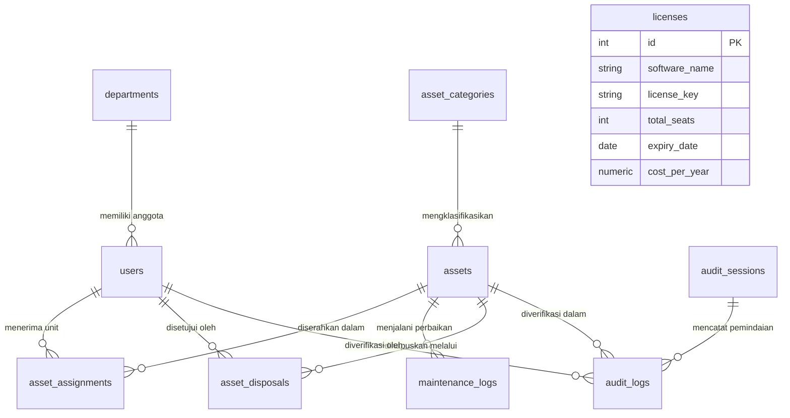

# Dokumentasi Database & Skema Relasional (PostgreSQL)

Sistem **IT Asset Management** menggunakan basis data relasional **PostgreSQL**. Struktur basis data dirancang untuk menjaga integritas data aset fisik, riwayat perpindahan/penyerahan unit, pemeliharaan teknis, pemusnahan aset, serta sesi audit opname fisik.

---

## 1. Diagram Relasi Entitas (ERD Overview)



---

## 2. Struktur Tabel & Kamus Data

### 2.1. Tabel `users`
Menyimpan data master pengguna, mencakup karyawan penerima unit kerja maupun pemegang akun login sistem (Executive, IT, Finance, Governance).

| Kolom | Tipe Data | Keterangan & Batasan |
| :--- | :--- | :--- |
| `id` | `SERIAL PRIMARY KEY` | ID unik internal pengguna |
| `employee_id` | `VARCHAR(50) UNIQUE NOT NULL` | NIK / Nomor Induk Karyawan |
| `name` | `VARCHAR(150) NOT NULL` | Nama lengkap karyawan / petugas |
| `email` | `VARCHAR(150) UNIQUE NOT NULL` | Alamat email perusahaan |
| `department` | `VARCHAR(100)` | Nama divisi / unit kerja |
| `password_hash` | `VARCHAR(255)` | Salt + Scrypt hash (`salt:hash`) untuk akun berwenang login |
| `role` | `VARCHAR(30) DEFAULT 'employee'` | Hak akses (`director`, `it_asset_manager`, `head_it`, `finance`, `lead_it_gov`, `super_admin`, `it_technician`, `employee`) |
| `is_active` | `BOOLEAN DEFAULT TRUE` | Status aktif akun pengguna |
| `created_at` | `TIMESTAMP` | Waktu registrasi data |

---

### 2.2. Tabel `departments`
Menyimpan data master divisi atau departemen di organisasi.

| Kolom | Tipe Data | Keterangan & Batasan |
| :--- | :--- | :--- |
| `id` | `SERIAL PRIMARY KEY` | ID unik departemen |
| `name` | `VARCHAR(100) UNIQUE NOT NULL` | Nama divisi (contoh: *Information Technology*, *Finance*) |
| `code` | `VARCHAR(30) UNIQUE` | Kode singkatan divisi (contoh: `IT`, `FIN`, `HR`) |
| `description` | `TEXT` | Uraian fungsi departemen |
| `created_at` | `TIMESTAMP` | Waktu penambahan departemen |

---

### 2.3. Tabel `asset_categories`
Kategori jenis perangkat keras (Hardware).

| Kolom | Tipe Data | Keterangan & Batasan |
| :--- | :--- | :--- |
| `id` | `SERIAL PRIMARY KEY` | ID unik kategori |
| `name` | `VARCHAR(100) NOT NULL` | Nama kategori (contoh: *Laptop*, *Server*, *Monitor*) |
| `code` | `VARCHAR(20) UNIQUE NOT NULL` | Kode kategori (contoh: `NB` untuk Notebook, `SRV`, `MON`) |

---

### 2.4. Tabel `assets`
Tabel master inventaris seluruh perangkat keras IT perusahaan.

| Kolom | Tipe Data | Keterangan & Batasan |
| :--- | :--- | :--- |
| `id` | `SERIAL PRIMARY KEY` | ID unik aset |
| `asset_tag` | `VARCHAR(50) UNIQUE NOT NULL` | Kode identitas label aset (misal: `IT-NB-2026-0001`) |
| `category_id` | `INTEGER REFERENCES asset_categories(id)` | Kategori perangkat (`ON DELETE SET NULL`) |
| `serial_number` | `VARCHAR(100) UNIQUE NOT NULL` | Nomor seri pabrikan perangkat |
| `brand` | `VARCHAR(100) NOT NULL` | Merk / Vendor perangkat (contoh: Lenovo, Dell, Apple) |
| `model` | `VARCHAR(100) NOT NULL` | Seri tipe perangkat (contoh: ThinkPad T14 Gen 4) |
| `specs` | `JSONB` | Spesifikasi hardware dalam format JSON (`{"cpu": "...", "ram": "...", "storage": "..."}`) |
| `mac_address_lan` | `VARCHAR(50)` | Alamat fisik kartu jaringan kabel Ethernet |
| `mac_address_wifi`| `VARCHAR(50)` | Alamat fisik kartu jaringan nirkabel Wi-Fi |
| `purchase_date` | `DATE` | Tanggal pembelian aset |
| `warranty_expiry` | `DATE` | Tanggal habis masa berlaku garansi vendor |
| `status` | `VARCHAR(30) DEFAULT 'in_stock'` | Status siklus unit: `'in_stock'`, `'deployed'`, `'repair'`, `'disposed'` |
| `created_at` | `TIMESTAMP` | Waktu data aset dibuat |

---

### 2.5. Tabel `asset_assignments`
Mencatat riwayat peminjaman / penyerahan unit perangkat kerja ke karyawan.

| Kolom | Tipe Data | Keterangan & Batasan |
| :--- | :--- | :--- |
| `id` | `SERIAL PRIMARY KEY` | ID transaksi penyerahan unit (menjadi nomor referensi BAST) |
| `asset_id` | `INTEGER REFERENCES assets(id)` | Referensi ke aset terkait (`ON DELETE CASCADE`) |
| `user_id` | `INTEGER REFERENCES users(id)` | Referensi ke karyawan penerima unit (`ON DELETE CASCADE`) |
| `assigned_date` | `DATE DEFAULT CURRENT_DATE` | Tanggal penyerahan unit |
| `returned_date` | `DATE` | Tanggal unit dikembalikan ke tim IT |
| `condition_notes` | `TEXT` | Catatan kelengkapan saat serah terima / pengembalian |
| `bast_file_url` | `VARCHAR(255)` | Dokumen arsip BAST fisik (jika ada lampiran eksternal) |
| `status` | `VARCHAR(30) DEFAULT 'active'` | Status penyerahan: `'active'` (sedang dipakai) atau `'returned'` (telah dikembalikan) |

---

### 2.6. Tabel `maintenance_logs`
Mencatat tiket servis, perbaikan teknis ke vendor, penggantian sparepart, dan rekapitulasi biaya.

| Kolom | Tipe Data | Keterangan & Batasan |
| :--- | :--- | :--- |
| `id` | `SERIAL PRIMARY KEY` | ID unik log servis |
| `asset_id` | `INTEGER REFERENCES assets(id)` | Referensi ke aset yang diservis (`ON DELETE CASCADE`) |
| `issue_description` | `TEXT NOT NULL` | Gejala / deskripsi kendala teknis |
| `vendor_name` | `VARCHAR(150)` | Nama vendor servis resmi / pihak ketiga |
| `cost` | `NUMERIC(15, 2) DEFAULT 0` | Biaya perbaikan / suku cadang |
| `start_date` | `DATE DEFAULT CURRENT_DATE` | Tanggal masuk perbaikan |
| `completion_date` | `DATE` | Tanggal perbaikan selesai |
| `action_taken` | `TEXT` | Tindakan perbaikan yang telah dilakukan |
| `status` | `VARCHAR(30) DEFAULT 'in_progress'`| Status tiket: `'in_progress'` atau `'completed'` |
| `created_at` | `TIMESTAMP` | Waktu log dibuat |

---

### 2.7. Tabel `asset_disposals`
Mencatat pemusnahan atau penghapusan permanen aset dari peredaran aktif.

| Kolom | Tipe Data | Keterangan & Batasan |
| :--- | :--- | :--- |
| `id` | `SERIAL PRIMARY KEY` | ID unik dokumen disposal |
| `asset_id` | `INTEGER REFERENCES assets(id)` | Referensi ke aset yang dihapuskan (`ON DELETE CASCADE`) |
| `disposal_type` | `VARCHAR(50) NOT NULL` | Metode pemusnahan (contoh: *Lelang*, *Hibah*, *Scrap Fisik*, *Daur Ulang*) |
| `disposal_date` | `DATE DEFAULT CURRENT_DATE` | Tanggal penghapusan unit |
| `residual_value` | `NUMERIC(15, 2) DEFAULT 0` | Nilai sisa buku / nilai residu penjualan (Rp) |
| `data_wiped` | `BOOLEAN DEFAULT FALSE` | Flag kepatuhan sanitasi data memori / storage |
| `wipe_method` | `VARCHAR(100)` | Standar pembersihan data (misal: *NIST 800-88 Clear/Purge*, *DoD 5220.22-M*) |
| `approved_by` | `INTEGER REFERENCES users(id)` | Pejabat berwenang yang menyetujui pemusnahan |
| `reason` | `TEXT` | Alasan penghapusan (misal: *Rusak total tidak ekonomis*, *End-of-Life*) |
| `disposal_doc_url` | `VARCHAR(255)` | URL berkas lampiran Berita Acara Pemusnahan |
| `created_at` | `TIMESTAMP` | Waktu pencatatan disposal |

---

### 2.8. Tabel `licenses`
Mencatat kepemilikan lisensi perangkat lunak (Software Asset Management).

| Kolom | Tipe Data | Keterangan & Batasan |
| :--- | :--- | :--- |
| `id` | `SERIAL PRIMARY KEY` | ID unik lisensi |
| `software_name` | `VARCHAR(150) NOT NULL` | Nama aplikasi (contoh: Microsoft 365, Adobe CC, JetBrains) |
| `license_key` | `VARCHAR(255)` | Kunci lisensi / Kode registrasi |
| `total_seats` | `INTEGER DEFAULT 1` | Jumlah kuota pengguna / instalasi berlisensi |
| `expiry_date` | `DATE` | Tanggal kedaluwarsa masa langganan lisensi |
| `cost_per_year` | `NUMERIC(15, 2) DEFAULT 0`| Biaya langganan lisensi per tahun (Rp) |

---

### 2.9. Tabel `audit_sessions` & `audit_logs`
Mendukung proses Stock Opname / Audit Fisik Berkala berbasis QR Code Scanner.

#### `audit_sessions`
| Kolom | Tipe Data | Keterangan |
| :--- | :--- | :--- |
| `id` | `SERIAL PRIMARY KEY` | ID unik sesi audit |
| `name` | `VARCHAR(150) NOT NULL` | Nama sesi (misal: *Audit Semester I 2026*) |
| `start_date` | `DATE DEFAULT CURRENT_DATE` | Tanggal pembukaan sesi audit |
| `end_date` | `DATE` | Tanggal penutupan sesi audit |
| `status` | `VARCHAR(30) DEFAULT 'ongoing'` | Status sesi: `'ongoing'` atau `'completed'` |
| `created_at` | `TIMESTAMP` | Waktu sesi dibuat |

#### `audit_logs`
| Kolom | Tipe Data | Keterangan |
| :--- | :--- | :--- |
| `id` | `SERIAL PRIMARY KEY` | ID catatan pemindaian audit |
| `session_id` | `INTEGER REFERENCES audit_sessions(id)` | ID sesi audit (`ON DELETE CASCADE`) |
| `asset_id` | `INTEGER REFERENCES assets(id)` | ID aset yang diverifikasi (`ON DELETE CASCADE`) |
| `scanned_by` | `INTEGER REFERENCES users(id)` | Akun auditor/teknisi yang memindai unit |
| `scanned_at` | `TIMESTAMP DEFAULT CURRENT_TIMESTAMP` | Waktu pemindaian stiker QR di lokasi |
| `physical_location` | `VARCHAR(150)` | Lokasi fisik unit ditemukan (contoh: *Lantai 2 - Meja 4*) |
| `condition` | `VARCHAR(50) DEFAULT 'good'` | Kondisi fisik perangkat (`good`, `damaged`, dll.) |
| `notes` | `TEXT` | Catatan khusus auditor |

*Catatan Integritas:* Terdapat constraint unik `CONSTRAINT uq_audit_session_asset UNIQUE (session_id, asset_id)` untuk mencegah entri ganda pada sesi yang sama (otomatis di-upsert).

---

## 3. Indeks Kinerja Database

Untuk menjaga performa kueri pada volume data inventaris berskala besar, indeks berikut dibuat:

```sql
CREATE INDEX IF NOT EXISTS idx_assets_asset_tag ON assets(asset_tag);
CREATE INDEX IF NOT EXISTS idx_assets_serial_number ON assets(serial_number);
CREATE INDEX IF NOT EXISTS idx_assets_status ON assets(status);
CREATE INDEX IF NOT EXISTS idx_asset_assignments_asset_status ON asset_assignments(asset_id, status);
CREATE INDEX IF NOT EXISTS idx_asset_assignments_user_id ON asset_assignments(user_id);
CREATE INDEX IF NOT EXISTS idx_maintenance_logs_asset_id ON maintenance_logs(asset_id);
CREATE INDEX IF NOT EXISTS idx_audit_logs_session_id ON audit_logs(session_id);
```
