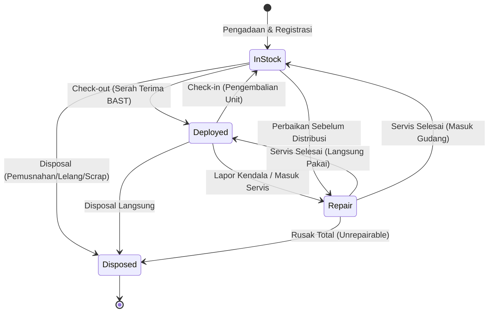

# Panduan Alur Kerja & Operasional Sistem (SOP & Workflows)

Dokumen ini menjelaskan alur operasional standar (SOP) pengelolaan aset teknologi informasi di lingkungan perusahaan menggunakan aplikasi **IT Asset Management**.

---

## 1. Siklus Hidup Aset (Asset Lifecycle)

Setiap aset TI yang masuk ke perusahaan mengikuti tahapan siklus hidup berikut:



---

## 2. Alur Kerja Operasional Detail

### 2.1. Pendaftaran & Impor Aset Baru
1. **Input Manual via Antarmuka:**
   - Navigasi ke menu **Master Inventaris** (`/assets`).
   - Klik tombol **"Tambah Aset Baru"**.
   - Masukkan Tag Aset (misal `IT-NB-2026-0010`), Kategori, Merk, Model, Serial Number, Spesifikasi (CPU, RAM, Disk), Tanggal Beli, dan Masa Berlaku Garansi.
   - Status awal unit otomatis adalah `in_stock`.

2. **Impor Massal via Berkas CSV:**
   - Siapkan berkas CSV sesuai format contoh:
     ```csv
     asset_tag,category_code,serial_number,brand,model,cpu,ram,storage,warranty_expiry,purchase_date
     IT-NB-2026-0020,NB,SN123456,Lenovo,ThinkPad T14,Intel i7,16GB,512GB SSD,2027-12-31,2024-01-15
     ```
   - Jalankan skrip impor melalui terminal:
     ```bash
     npx tsx scripts/import-assets.ts path/to/data-aset.csv
     ```
   - Sistem secara otomatis mencocokkan kode kategori, memvalidasi duplikasi nomor tag, dan memasukkan unit ke basis data.

---

### 2.2. Pembuatan & Pencetakan Label QR Code
1. Navigasi ke menu **Cetak Label QR** (`/assets/print-labels`).
2. Sistem akan memuat seluruh daftar aset dan secara dinamis membuat QR Code berbasis nilai `asset_tag`.
3. Pilih aset yang hendak dicetak (bisa pilih seluruhnya atau centang unit tertentu).
4. Klik tombol **"Cetak Label"** atau gunakan shortcut `Ctrl + P`.
5. Format cetak telah diatur secara rapi dalam grid label standar untuk ditempelkan pada fisik laptop, monitor, casing PC, atau perangkat jaringan.

---

### 2.3. Penyerahan Unit ke Karyawan (Check-out) & BAST
1. Buka menu **Master Inventaris** (`/assets`) atau gunakan **Scan Fisik** (`/scan`).
2. Cari unit dengan status `in_stock`.
3. Klik menu aksi pada baris aset, lalu pilih **"Serah Terima (Check-out)"**.
4. Pilih nama karyawan penerima dan lengkapi catatan kondisi fisik awal serta kelengkapan (misal: *Adaptor charger, tas laptop, mouse*).
5. Klik konfirmasi. Sistem akan:
   - Mengubah status aset menjadi `deployed`.
   - Membuat rekaman mutasi aktif pada tabel `asset_assignments`.
   - Mengembalikan tombol langsung untuk membuka **Dokumen BAST Digital**.
6. **Pencetakan BAST:**
   - Dokumen BAST resmi akan terbuka pada jendela cetak (`/api/assets/bast/[id]`).
   - Dokumen siap dicetak dalam format A4 untuk ditandatangani oleh Pihak Pertama (IT) dan Pihak Kedua (Karyawan Penerima).

---

### 2.4. Pengembalian Unit ke Gudang IT (Check-in)
1. Saat karyawan melakukan mutasi divisi, pengunduran diri (offboarding), atau penggantian perangkat (refresh cycle):
2. Buka menu **Master Inventaris** atau **Scan Fisik**.
3. Temukan unit yang berstatus `deployed`, lalu klik **"Pengembalian (Check-in)"**.
4. Catat kondisi unit saat dikembalikan (kelengkapan fisik, kondisi layar, bodi, dan fungsi perangkat).
5. Klik konfirmasi:
   - Sesi penyerahan ditutup (`status = 'returned'`).
   - Status aset otomatis kembali menjadi `in_stock` dan siap didistribusikan ulang.

---

### 2.5. Pemeliharaan & Perbaikan (Maintenance Tracking)
1. **Pendaftaran Servis:**
   - Unit yang mengalami kerusakan dapat didaftarkan melalui menu **Master Inventaris**, menu **Scan Fisik**, atau halaman **Unit Saya** (`/my-assets`) oleh karyawan.
   - Isi deskripsi kendala teknis, nama vendor servis resmi (misal: Service Center Resmi Lenovo), dan estimasi biaya.
   - Status aset otomatis berubah menjadi `repair`.
   - Sistem secara otomatis mengirimkan notifikasi tiket perbaikan ke **Telegram Bot IT**.
2. **Penyelesaian Servis:**
   - Ketika unit telah selesai diperbaiki oleh vendor, klik opsi **"Selesaikan Servis"**.
   - Masukkan tindakan perbaikan teknis (`action_taken`), total biaya akhir, serta pilih target status unit (`in_stock` untuk disimpan atau `deployed` jika langsung diserahkan kembali ke pengguna).

---

### 2.6. Sesi Audit Opname Fisik Berkala (Stock Opname)
Proses verifikasi keberadaan fisik unit di lapangan menggunakan stiker QR Code:
1. Masuk ke menu **Audit / Opname** (`/audit`).
2. Jika belum ada sesi aktif, klik **"Mulai Sesi Audit Baru"** (misal: *Audit Opname IT Q1 2026*).
3. Tim IT / Auditor dapat membawa laptop, tablet, atau smartphone ke lokasi (kantor pusat, cabang, ruang server).
4. Buka menu **Scan Fisik (Kamera)** (`/scan`) atau input langsung di halaman audit:
   - Arahkan kamera ke stiker QR Code pada laptop/perangkat.
   - Sistem membaca `asset_tag` seketika.
   - Verifikasi lokasi fisik saat ini (misal: *Lantai 2 - Meja Finance 04*) dan kondisi unit (`good`, `damaged`, dll.).
   - Klik **"Verifikasi Aset"**.
5. Catatan langsung tersimpan ke log sesi audit.
6. Setelah seluruh unit selesai diverifikasi, klik tombol **"Tutup & Selesaikan Sesi Audit"**.

---

### 2.7. Pemusnahan Aset Permanen (Disposal)
Unit yang sudah tidak layak pakai, rusak total tak ekonomis diperbaiki, atau mencapai akhir masa pakai (End-of-Life) harus melalui prosedur disposal:
1. Buka menu **Master Inventaris** atau halaman detail aset.
2. Klik tombol **"Hapus / Musnahkan (Disposal)"**.
3. Lengkapi formulir:
   - **Metode Pemusnahan:** Lelang Karyawan, Hibah Sosial, Scrap Logam/E-Waste, atau Daur Ulang.
   - **Nilai Residu:** Estimasi nilai sisa buku / penjualan barang rongsok (Rp).
   - **Sanitasi Data:** Wajib centang konfirmasi penghapusan data storage, dan pilih metode penghapusan data (misal: *NIST 800-88 Cryptographic Erase* atau *DoD 5220.22-M*).
   - **Alasan & Pejabat Penyetujui:** Masukkan pejabat yang mengesahkan disposal (Direktur / Head of IT).
4. Setelah konfirmasi, status aset terkunci menjadi `disposed` dan penyerahan aktif ditutup permanen.

---

### 2.8. Rekapitulasi & Pelaporan Multiformat
1. Masuk ke menu **Rekap & Laporan** (`/reports`).
2. Pilih tipe laporan yang dibutuhkan:
   - **Riwayat Penyerahan (Assignments):** Laporan mutasi penyerahan & pengembalian unit kerja.
   - **Pemeliharaan & Biaya (Maintenance):** Rekapitulasi biaya perbaikan teknis & riwayat vendor.
   - **Pemusnahan & Nilai Sisa (Disposal):** Rekapitulasi unit yang dihapuskan dan nilai salvage.
   - **Inventaris Aset Keseluruhan:** Audit status aset keseluruhan.
   - **Lisensi Perangkat Lunak:** Rekap biaya tahunan langganan software.
   - **Hasil Audit Fisik:** Rekap unit yang terverifikasi saat stock opname.
3. Atur rentang tanggal (`Mulai` s/d `Sampai`).
4. Klik **"Tampilkan Laporan"** untuk melihat rekapitulasi KPI dan tabel data.
5. Klik **"Unduh CSV"** untuk mengekspor data ke Microsoft Excel atau format spreadsheet analitik lainnya.
